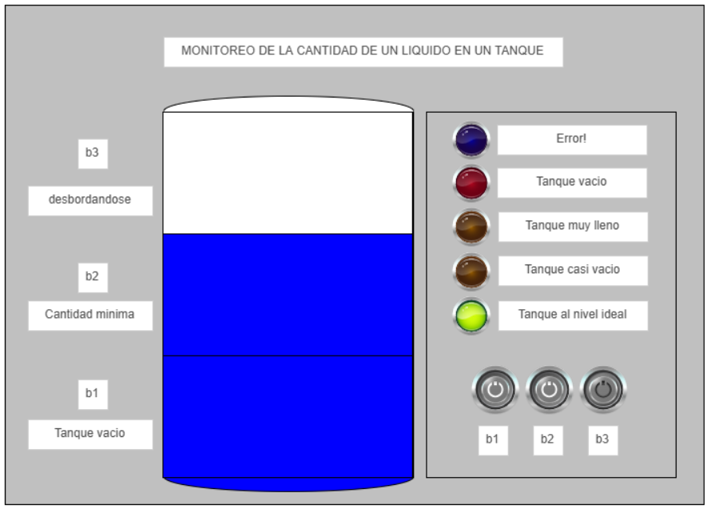
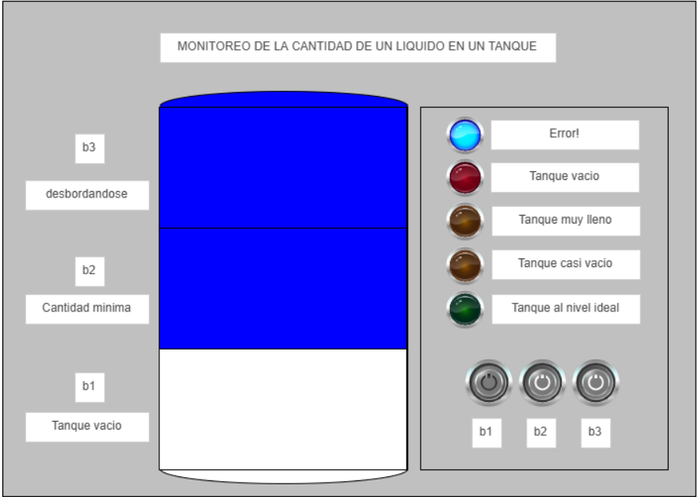

# RA 2.3: Industrial Automation – Chemical Tank Level Monitoring Darek Aljuri Martinez

## Introducción

Este proyecto tiene como objetivo diseñar e implementar una automatización combinacional para el monitoreo de niveles en un tanque químico utilizando sensores discretos y un PLC. El control de niveles es   fundamental para **evitar desbordes, fugas, desperdicios y liberar personal para que se puedan encargar de labores mas importantes**, garantizando seguridad en la planta y eficiencia en el consumo de recursos. Asi mismo busca desarrolar en los estudiantes la capacidad de usar herramientas como CODESYS y OPENPLC para hacer PLCs funcionales que puedan ser probados dentro de una simulación y pasados a hardware fisico y tener un resultado similar al visto en estas herramientas.

## 1️. Diseño lógico (Combinacional)

Se definieron para el proyecto tres entradas/inputs y cinco salidas/outputs, con el fin de simular el comportamiento que tendrian los sensores que detecten donde esta el nivel del liquido dentro del tanque y los actuadores que le indican al personal en que estado se encuentra el liquido y con esto poder definir que acción tomar. Es necesario pensar en como funcionara el sistema dependiendo de sus entradas y como el estado de estas genera una salida distinta. Por esto nos tenemos que basar en la logica combinacional para saber todas las posibles combinaciones que tien nuestro sistema.

  Inputs (Los tres seran considerados sensores):

    b1: Tanque vacio.
    
    b2: Lleno al minimo nivel.
    
    b3: Tanque muy lleno, al punto de desbordarse.

  Outputs (Los cinco seran considerados LEDs):

    H1: Nivel de llenado correcto
    
    H2: Nivel de llenado demasiado bajo
    
    H3: Nivel de llenado demasiado alto
    
    H4: Tanque vacio.
    
    H5: Error, estados no posibles.

Que led este prendido depende de la combinación de los valores de los tres sensores, y solo podra haber un led prendido a la vez, es decir cada led tiene una combinación unica de los estados de la entradas que hace que unicamente este se prenda. Para esto tenemos que hacer la tabla de verdad que es donde pondremos las distintas combinaciones en las que se pueden encontrar las entradas y cual es la salida esperada.

  ### Tabla de verdad

  

  Esta es la tabla de verdad resultante del comportamiento planteado en la actividad, cada entrada y salida tiene su respectiva columna y hay una columna extra que nos indica cual es el estado esperado a partir de las entradas. Cada fila tiene una combinación diferente en los valores que toman las entradas, siendo 0 ausencia del liquido en ese sensor y 1 presencia del liquido en ese sensor, la cantidad de filas que hay depende de la cantidad de entradas,en nuestro caso tenemos tres entradas, por ende operamos 2^3 = 8, la cantidad de filas que tiene la tabla de verdad. De H1 a H4, solo hay una combinación que permite dichas salidas, por el mismo planteamieto del ejercicio, pero para H5 hay cuatro combinaciones distintas que dan como resultado esta salida y esto se debe a que hay diferentes maneras en las cuales se podria presentar un error en el sistema. 
  
  
  ### Funciones booleanas
  
#### 1. Principio general
   
Una función booleana se deriva identificando las filas donde la salida vale 1. Para cada fila con salida = 1 se construye un producto lógico (AND) de las entradas.
      
En ese producto, cada entrada va:
      
      Directa si en la fila su valor es 1.
        
      Negada (¬) si en la fila su valor es 0.
  
Si una salida se enciende en más de una fila, se hace la suma lógica (OR, ∨) de todos esos productos.

#### 2. Aplicando al caso

  H1 (correct)

    Solo se enciende en la fila 110 (b1=1, b2=1, b3=0).
    
    Entonces: H1 = b1 ∧ b2 ∧ ¬b3

  H2 (too low)
  
    Solo se enciende en la fila 100 (b1=1, b2=0, b3=0).
    
    Entonces: H2 = b1 ∧ ¬b2 ∧ ¬b3
  
  H3 (too high)
  
    Solo se enciende en la fila 111 (b1=1, b2=1, b3=1).
    
    Entonces: H3 = b1 ∧ b2 ∧ b3
  
  H4 (empty)
  
    Solo se enciende en la fila 000 (b1=0, b2=0, b3=0).
    
    Entonces: H4 = ¬b1 ∧ ¬b2 ∧ ¬b3
  
  H5 (error)
  
    Se enciende en varias filas (001, 010, 011, 101).
    
    Si escribiéramos todas esas filas como minterms, tendríamos 4 productos OR.
    
    Pero podemos simplificar detectando el patrón común de inconsistencia:
    
      Error si b3=1 pero b2=0 → (b3 ∧ ¬b2)
      
      Error si b3=1 pero b1=0 → (b3 ∧ ¬b1)
      
      Error si b2=1 pero b1=0 → (b2 ∧ ¬b1)
    
    Resultado simplificado: H5 = (¬b1 ∧ (b2 ∨ b3)) ∨ (b3 ∧ ¬b2)

#### 3. En resumen
  Cada función booleana es la traducción directa de la tabla:
  
  H1–H4 corresponden a un único minterm (una sola combinación de entradas).
  
  H5 corresponde a la OR de varios minterms, luego simplificada para reducir puertas.
  
  ### Circuito lógico

  ### H1 – Fill Level Correct (110)

  
  
  El circuito se activa únicamente cuando **b1=1**, **b2=1** y **b3=0**.  
  - Se implementa con un **AND de tres entradas**, donde entran directamente b1 y b2, y la señal negada de b3 (¬b3).  
  - Esto garantiza que el LED H1 solo se encienda cuando los dos sensores inferiores están activos y el superior apagado, condición que representa el nivel deseado del tanque.
  
  
  ### H2 – Fill Level Too Low (100)

  

  Este circuito detecta cuando **solo el sensor inferior b1 está activo** (b1=1, b2=0, b3=0).  
  - Se implementa con un **AND de tres entradas** que combina b1, ¬b2 y ¬b3.  
  - De esta forma, H2 se enciende únicamente cuando el tanque tiene líquido en el nivel más bajo, indicando que el nivel es insuficiente.
  
  
  ### H3 – Fill Level Too High (111)

  
  
  Se enciende cuando **todos los sensores están activos** (b1=1, b2=1, b3=1).  
  - Se implementa con un **AND de tres entradas** sin negaciones, porque los tres deben estar en estado 1.  
  - Representa que el tanque está lleno y el nivel es demasiado alto.
  
  
  ### H4 – Tank Empty (000)

  
  
  Este circuito se activa cuando **ningún sensor detecta líquido** (b1=0, b2=0, b3=0).  
  - Se implementa con un **AND de tres entradas** de las señales negadas: ¬b1, ¬b2 y ¬b3.  
  - El LED H4 se enciende cuando el tanque está vacío.
  
  
  ### H5 – Error (inconsistencias de sensores)

  
  
  El circuito de error se enciende cuando las combinaciones de sensores no tienen sentido físico (ej. b3=1 y b2=0).  
  - Se construyó detectando dos condiciones principales:  
    - **¬b1 ∧ (b2 ∨ b3)** → cuando los sensores medio o alto detectan líquido, pero el inferior no.  
    - **b3 ∧ ¬b2** → cuando el sensor alto detecta líquido pero el medio está apagado.  
  - Ambas condiciones se combinan en un **OR**, encendiendo H5 en cualquier caso de fallo.  
  - Esto asegura que el sistema no muestre un estado válido si los sensores no son coherentes entre sí.
  

## 2️. Implementación en CODESYS y uso de HMI

### Explicación lenguaje ladder

  Ahora que ya tenemos los circuitos logicos podemos pasarlos a logica/diagrama ladder, en donde cambian un poco las cosas, su forma se asemeja a la de una escalera, es secuencial y se lee de izquierda a derecha y de arriba a abajo. Las entradas son representadas como "Contactos", [entrada], ubicadas en la parte izquierda de la escalera y estos pueden estar normalmente abiertos (1, si el evento es verdadero permite el flujo de corriente) o normalmente cerrados (0 / negación, permite flujo de corriente siempre hasta que el evento sea verdadero), las salidas son representadas como "bobinas", (salida), y estan ubicadas en la parte derecha de escalera. Para representar un AND se hace poniendo un contacto al lado del otro, es decir solo fluye la corriente si la condición de ambos se cumple, y para representar un OR se hace poniendo un contacto en paralelo con otro, es decir fluye la corriente si alguna o ambas de las dos condiciones se cumple.

En Ladder cada rung (cada fila, que se asemeja a un escalon de la escalera) es equivalente a una ecuación booleana:

    Si conectamos en serie [b1]--[b2] y al final (H1), estamos implementando H1 = b1 ∧ b2.
    
    Si ponemos contactos en paralelo [b1] y [b2] antes de (H2), implementamos H2 = b1 ∨ b2.
    
    Si usamos un contacto cerrado [/b3], representamos la negación ¬b3.

Diagram ladder que sale a partir de los circuitos logicos:

En este caso se tomo la decisión de hacer uso de dos bobinas extras (T1 y T2), para poder simplificar la operación de H5 en el diagrama ladder.

### CODESYS

¿Qué es CODESYS?

    “The CODESYS Development System is the core of the software platform. It implements the international IEC 61131-3 standard” [1], el cual define los lenguajes de programación aceptados para PLCs, tales como Ladder, Function Block Diagram, Structured Text y Sequential Function Chart.
    
    Incluye un módulo de visualización/HMI para construir interfaces gráficas de monitoreo y control.

Definición de variables dentro de CODESYS:

Implementamos el diagrama ladder que obtuvimos dentro de CODESYS:

HMI en CODESYS: 

Una **HMI (Human-Machine Interface)** es la interfaz que permite la comunicación entre el operador y el proceso automatizado.  
Su función es **mostrar de manera gráfica la información del sistema** (niveles, alarmas, estados) y permitir que el usuario **interactúe con el PLC** de forma sencilla.

En este proyecto la HMI nos sirve para:
- Visualizar los estados de los sensores de nivel (**b1, b2, b3**).  
- Observar las salidas (**H1–H5**) representadas con indicadores luminosos.  
- Simular el comportamiento del tanque sin necesidad de conectar hardware físico.  

### ¿Cómo funciona dentro de CODESYS?
- CODESYS incluye un editor de Visualizations donde se pueden crear pantallas gráficas.  
- Cada elemento gráfico (botón, lámpara, texto) se vincula directamente a una variable del PLC.  

Ejemplo:
- Un **botón toggle** se conecta a la variable `b1` → al presionarlo simula que el sensor bajo se activa.  
- Una **lámpara** se conecta a la variable `H1` → se enciende si la lógica del PLC determina que el tanque está en el nivel correcto.  

Durante la simulación, el PLC ejecuta el programa en **Ladder**, y la HMI refleja en tiempo real el estado de las entradas y salidas.

Dependieno del tipo de objetivo que pongamos dentro del espacio de visualización tendremos una manera diferente con la cual asignarle la variable asociada al objeto, su comportamiento y estado visual.
Para el caso de los interruptores y los leds es muy sencillo debido a que dentro de las propiedas ya aparece variable y solo es necesario asociarla, para los interruptores una input y para los leds una de output

Para el caso de los interruptores se veria asi:

Para el caso de los leds se veria asi:

Ahora para los otros objetos como lo seria cuadrados, rectangulos, texto, etc, toca meterse ya en otras secciones dentro de las propiedades, aqui asignaremos la variable de color y luego tenemos que modificar el objeto para el estado de alerta es decir cuando la variable output mande 1, asi mismo se podria esconder el objeto, pero para el caso del tanque lo dividi en diferentes objetos y cada uno lo asocie a la variable de sensor que le correspondia

Ejemplo del funcionamiento del PLC:

Tanque vacio:

Tanque en el estado ideal:

Error:

## 3. Implementación en OPENPLC

  **OpenPLC** es una plataforma de código abierto para programar y ejecutar lógicas de control en diferentes tipos de hardware.  
  Permite cargar programas en lenguajes IEC 61131-3 (como Ladder) y ejecutarlos en controladores reales como el **Arduino Uno**.  

  En este proyecto se utilizó OpenPLC para:
  
    - Traducir el programa de CODESYS a un entorno libre y compatible con hardware accesible.  
    - Mapear las entradas (`b1, b2, b3` → %IX0.0–%IX0.2) y salidas (`H1–H5` → %QX0.0–%QX0.4).  
    - Validar el comportamiento del sistema en un prototipo físico con **DIP switches** como sensores y **LEDs** como indicadores.  

### Definición de variables en OPENPLC

En OpenPLC todas las entradas y salidas deben declararse como **variables** y asociarse a una dirección física del PLC o del dispositivo en uso (en este caso, el Arduino Uno).  
Las direcciones se expresan con el formato **%IX** para entradas digitales y **%QX** para salidas digitales:

- **%IX** → Input (entrada digital).  
- **%QX** → Output (salida digital).  
- El número después indica el byte y el bit (ejemplo: %IX0.0 es la primera entrada del primer byte).

La documentación de OPENPLC [2] menciona unicamente estas direcciones para digital In/Out :

Digital In	A0, A1, A2, A3, A4, A5, A6, A7	%IX0.0 – %IX0.7

Digital Out	D0, D1, D2, D3	%QX0.0 – %QX0.3

Queda faltando un digital out, debido a que se cuenta con 5 leds, para esto tenemos que hace la modificacion en el momento que vayamos a transerir el programa al plc en la parte de I/O Config, donde nos dicen cuales son los pines del arduino correspondientes a digital y analog inputs / outputs, modificaremos estos pines quitando el pin 6 de input y poniendola en output, con esto podemos contar con una dirección mas de outputs.

En este proyecto se definieron las siguientes variables:

| Variable | Dirección | Descripción                           | Hardware            |
|----------|-----------|---------------------------------------|---------------------|
| b1       | %IX0.0    | Sensor de nivel bajo                  | DIP switch → D2     |
| b2       | %IX0.1    | Sensor de nivel medio                 | DIP switch → D3     |
| b3       | %IX0.2    | Sensor de nivel alto                  | DIP switch → D4     |
| H1       | %QX0.0    | LED – Nivel correcto (110)            | LED → D7            |
| H2       | %QX0.1    | LED – Nivel demasiado bajo (100)      | LED → D8            |
| H3       | %QX0.2    | LED – Nivel demasiado alto (111)      | LED → D9            |
| H4       | %QX0.3    | LED – Tanque vacío (000)              | LED → D10           |
| H5       | %QX0.4    | LED – Error (inconsistencias)         | LED → D11           |

De esta manera, cada variable en el programa Ladder corresponde a un pin físico del Arduino Uno, lo que permite que las simulaciones en OpenPLC se traduzcan directamente en señales reales de entrada y salida.

Variables dentro de OPENPLC:

Diagrama ladder en OPENPLC:

Simulación dentro de OPENPLC, simulando el estado de tanque al nivel ideal: 

## 4. Validación con OPENPLC y Hardware (Arduino Uno) 
  
  Configuración de OpenPLC:

  Para poder pasar la logica al PLC usamos la opción de "Transfer program to PLC", es necesario tener el arduino conectado mediante el cable USB serial al computador, al hacer esto se podra seleccionar el puerto de comunicación y el tipo de board que se utiliza, en este caso el Arduino UNO.
  
  

  

  Despues de verificar esta en la placa y puerto correcto, le damos click al boton de "Transfer to PLC". Toca esperar un tiempo mientras se sube la logica ladder que hicimos al Arduino UNO, si la logica esta correcta deberia mostrar el siguiente mensaje en OPENPLC y con esto ya esta subido el programa al ARDUINO y se puede pasar a hacer el montaje fisico.

  

  ### Circuito fisico/Hardware:

  Entradas: DIP switch de 4 posiciones conectado a pines D2 ,D3 Y D4 (%IX0.0–%IX0.2).
  
  Salidas: 5 LEDs en pines D6, D7, D8, D12 Y D13 (%QX0.0–%QX0.4). Parte positiva del led conectada a la salida correspondiente, para que el led se ilumine unicamente cuando recibe 1 por parte del arduino.
  
  Fuente: 5 V del propio Arduino.

  Para el montaje se hiz uso de una protoboard, el Arduino UNO, 5 leds (opcionalmente agregarles resistencias), un dipswitch de 4 entradas, y jumpers para conectar de los pines del arduino a la protoboard. Para que los dipswitches funcionaran se usaron resistencias de 2.3 k ohmneos, tanto para el output como para la parte de abajo del dipswitch, en la practica me di cuenta que este funciona con resistencia pull up, estas son las que le permiten cambiar de estado correctamente en el momento que uno cambie el switch respectivo, asi mismo fue necesario ponerle resistencias en el output debido que si el dipswitch estaba en 0, los outputs aun los leia como uno despues de cierto tiempo, posiblemente por el ruido dentro de la protoboard, por esto mismo conecte resistencia pull down es decir hacia ground para que manteniera un estado estable de 0 cuando no habia ningun cambio en la señal sin que hubiera un cambio en el dipswitch, pero si uno hacia un cambio si cambia correctamente el estado y servia de la manera esperada.

  Fotos del circuito fisico:
   
   

   

   Estado tanque vacio 

   

   Estado tanque casi vacio 

   

   Estado tanque ideal

   

   Estado tanque lleno 

   

   Estado tanque error 1

   

   Estado tanque error 2 

   
   

## 5. Referencias:

[1] CODESYS Group, “CODESYS Development System – your programming tool,” CODESYS Group. [Online]. Available: https://us.codesys.com/products/engineering/development-system/.

[2] Autonomy Logic, "OpenPLC Documentation – Physical Addressing," Autonomy Logic, 2024. [Online]. Available: https://autonomylogic.com/docs/2-4-physical-addressing/.

